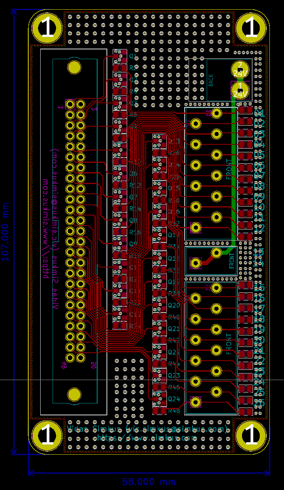

# G4 TO GROOV ADAPTER
## Motivation
I found out, after purchasing a pile of gear, that the G4 output modules mounted in a G4PB24 would not work with a GRV-ODCSRC-24.  Reason being that the GRV-ODCSRC-24 is a "sourcing" module, while the G4PB24 expects a "sinking" module.  

While this could have been better documented by OPTO 22, it is what is it and I needed to be able to used the G4PB24 for my project.  Nothing else would do for various reasons.

Hence this project.  The project is an adapter board with a 50 pin ribbon connector on one end and a spring loaded terminal on the other end.  The design is super simple - it's 24 NPN transistors.  

